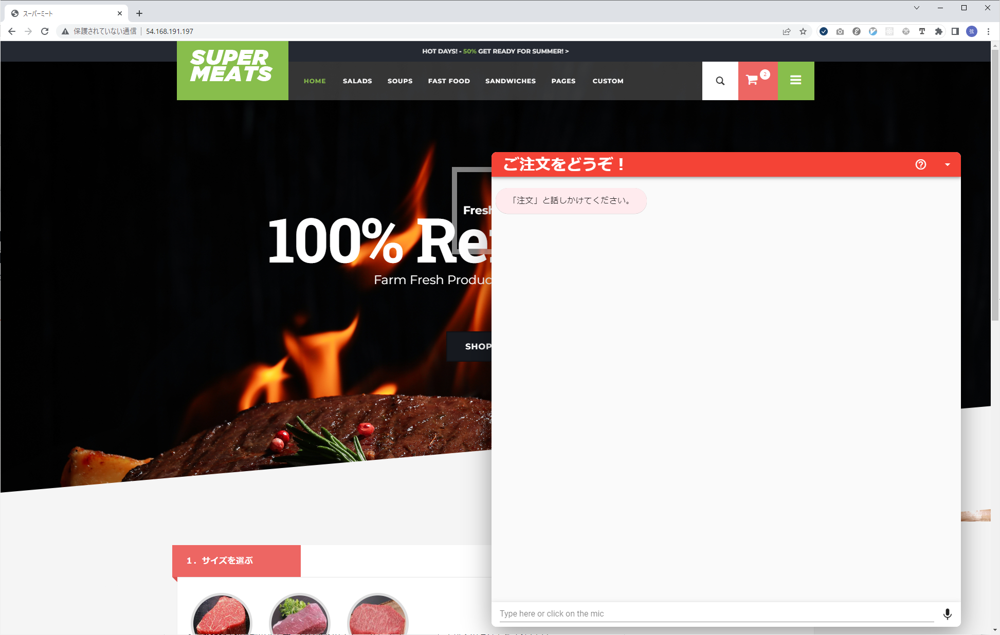

# CapsuleCloud Lex Demo

## リポジトリの説明

Amazon Lex の機能を紹介するデモ。

## 利用方法

## 1．Amazon Lex に新たなボットを作成する

1. コンソールにサインイン
2. Amazon Lex ダッシュボードにアクセス
3. ボットを作成
4. インテント、スロットを追加
5. 意図した動作となるようにテストを実施
6. [こちら](https://aws.amazon.com/jp/blogs/machine-learning/deploy-a-web-ui-for-your-chatbot/)のリンクの手順に従い、構築した Chatbot をデプロイ
7. 完了

## 2．Demo アプリケーションからチャット注文を利用する

### デモアプリケーションの動作環境

- Ruby 3.0.4
- Rails 7.0.3

### Demo 用アプリケーションを実行する

- `demo`ディレクトリに移動する

```(shell)
cd ./demo
```

- ライブラリをインストール

```(shell)
bundle install
```

- .env を以下のように編集する

```(text)
BASE_URL={CloudFormationの出力から取得したURL}
LOADER_SCRIPT={CloudFormationの出力から取得したURL}
```

※{}で囲われている部分は各々の内容に書き換える

- 起動

```(shell)
rails s
```

### Demo 用アプリケーションの動作

#### 操作方法



- 注文と話しかける


- 指示に従って入力を行う


- 注文が送信される
